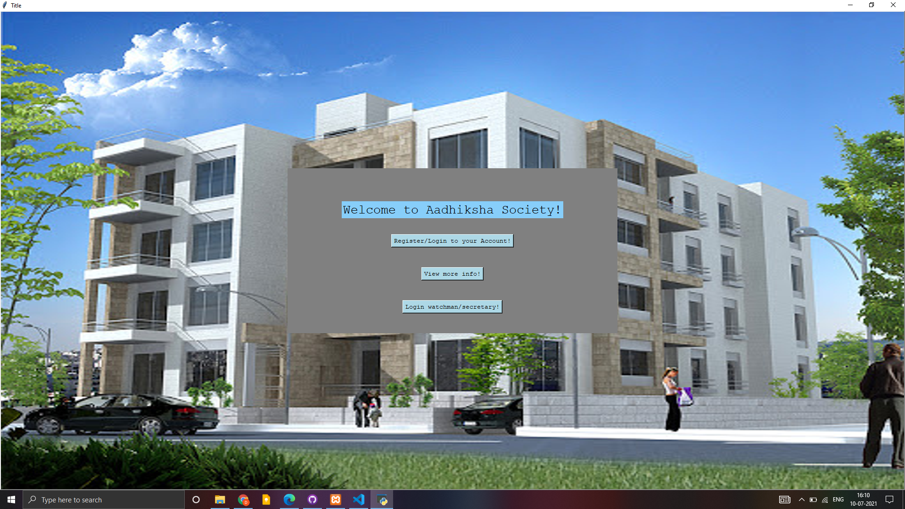
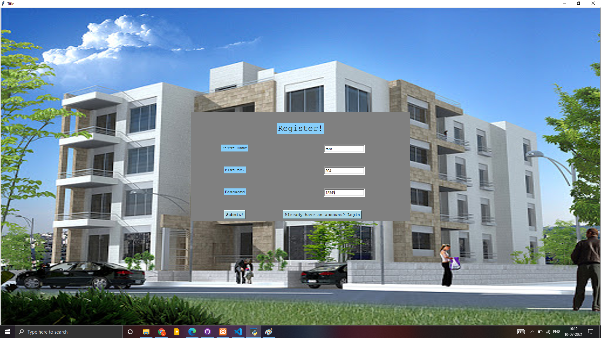
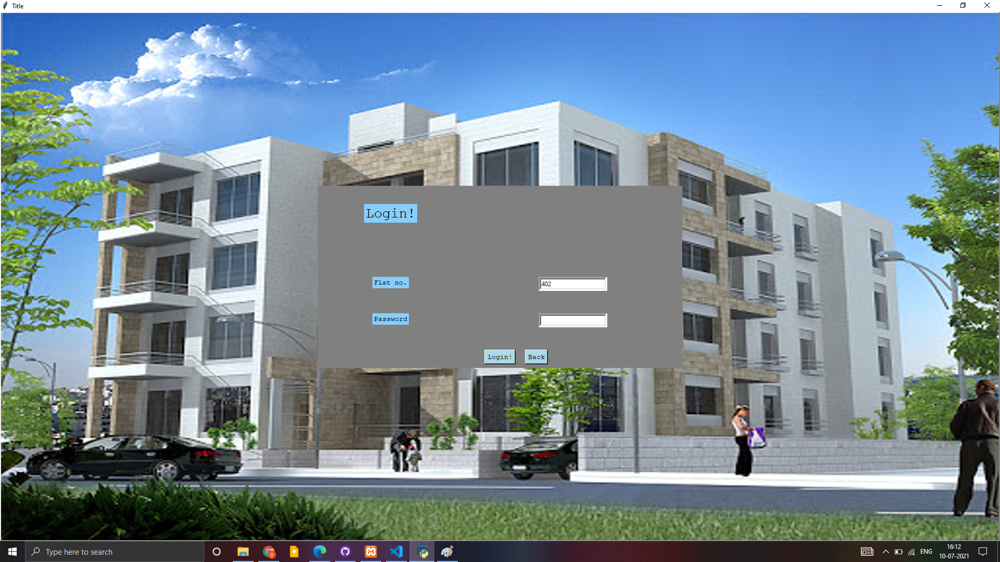
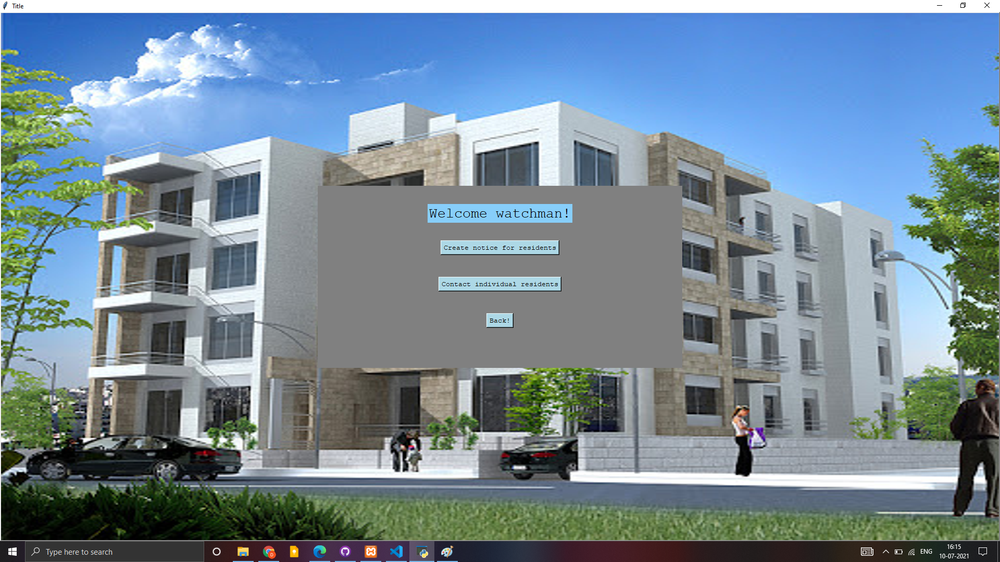
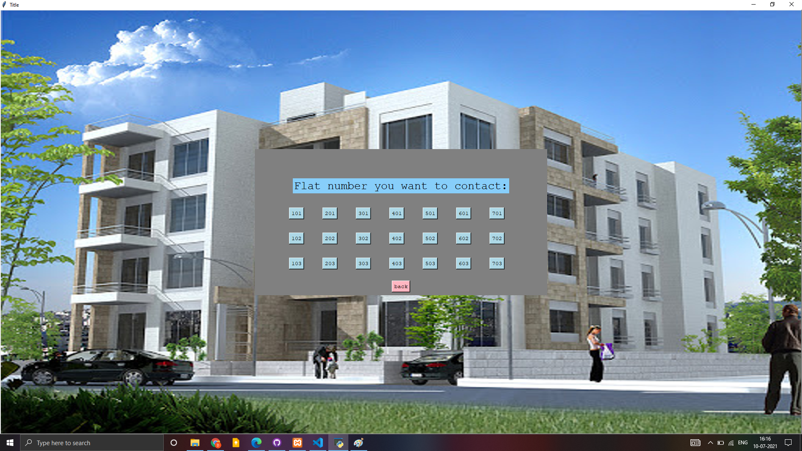

# Society Management System

society management system using python. 
GUI used:- Tkinter 
features added:- 
login/registration 
managing maintenance 
notice writing and displaying, etc

<h1>Screenshots:-</h1>

